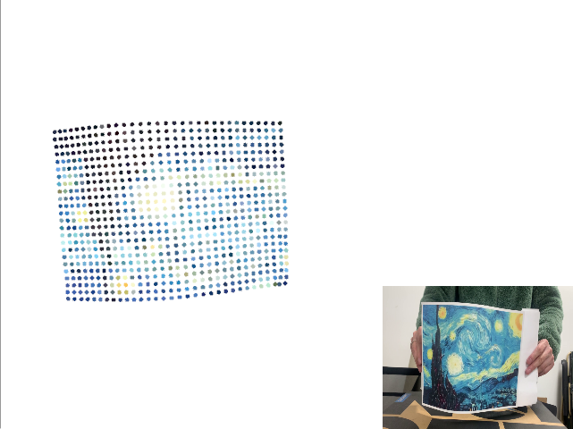

# ceres-backprojection

An experiment backprojecting the 2D points to 3d space base ceres-solver

 


### Data Preparation

the file structure:

```
.
└── data
    └── video
        ├── flows
        │   ├── 00000.flo
        │   ├── ...
        └── images
            ├── 00000.png
            ├── ...


```
we only need the frames in folder `images` and the flows in `flows` , then run the jupyter notebook [process.ipynb](data/process.ipynb) to generate the folder `points` under the video's path, in `points` folder, every file `000xxx.txt` is corresponding to a frame, the points is organized with the format `u1 v1 u2 v2` for every line, which means the 2d-2d correspondence from source to scene frame

Then we need to computer the 2d-3d correspondence from scene frame to the 3D pointcloud. However there is no additional conditions to obtain the 3D point, so we can only use some prior constraints, such as the pixel's neigborhood, so we use the [ceres-solver](https://github.com/ceres-solver/ceres-solver) to solve this problem.

### Build & Run

first we need to compile the code

```
mkdir build && cd build && cmake ..
```

then, if the data is not prepared, run the following command line, this may spend several minutes
```
run the [process.ipynb](data/process.ipynb)
./ceresBackProjection /path/to/video/

```

finally, run the visualization
```
./visualize /path/to/video
```